# Diagram Pipeline MLOps

Diagram Mermaid ini menunjukkan pipeline mini MLOps secara utuh untuk simulasi pembelajaran estimasi tarif transportasi online.

```mermaid
flowchart LR
    subgraph DataLayer["Data Layer"]
        A["Data Mentah<br/>cab_rides.csv + weather.csv"]
        B["Data Audit"]
    end

    subgraph CIStage["Tahap CI"]
        C["Validasi Data CI"]
        D["Data Cleaning"]
        E["Feature Engineering"]
        F["Preprocessing Pipeline"]
    end

    subgraph CTStage["Tahap CT"]
        G["Model Training"]
        H["Evaluasi Model"]
        I["Checklist Kualitas CT"]
    end

    subgraph CDStage["Tahap CD"]
        J["Model Registry"]
        K["Layanan API"]
        L["Shadow Deployment"]
    end

    subgraph MonitoringStage["Tahap Monitoring"]
        M["Monitoring"]
        N["Keputusan Rollback/Promosi"]
    end

    A --> B --> C --> D --> E --> F --> G --> H --> I --> J --> K --> L --> M --> N
    N -- "Promote (naik) jika stabil" --> K
    N -- "Rollback jika tidak stabil" --> J
```

Diagram ini dapat dirender menggunakan VSCode Markdown preview, GitHub Markdown, atau Mermaid Live Editor.
